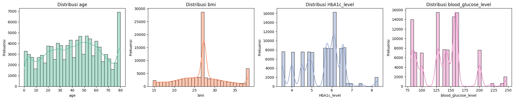
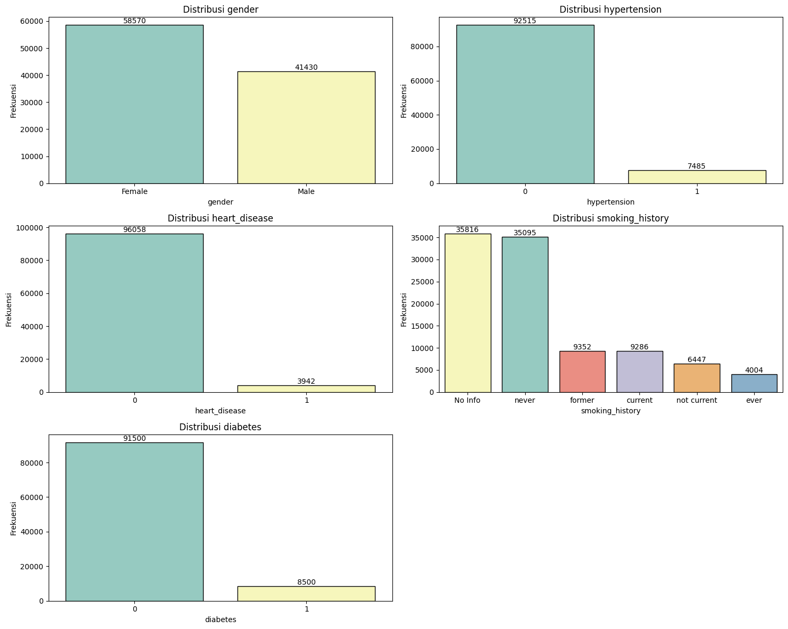
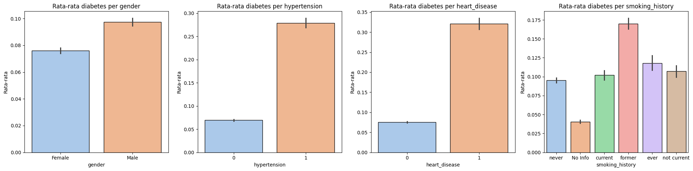
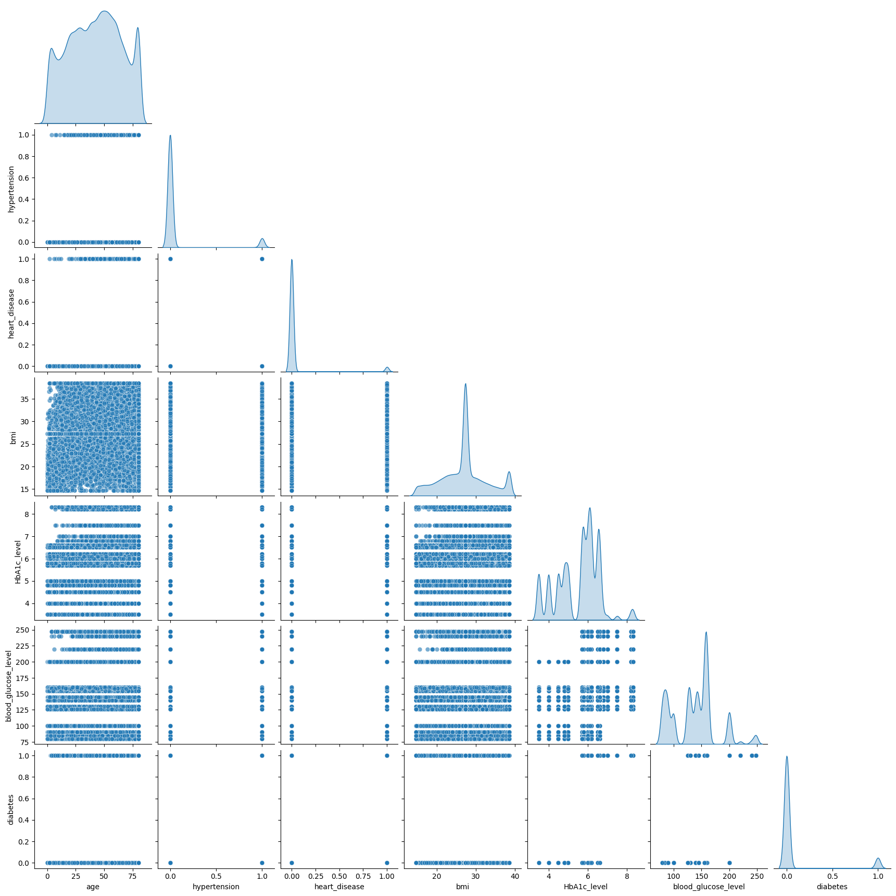

# Laporan Proyek Machine Learning - Muhammad Zukarnaini

## Domain Proyek

Menurut **[Lopana et al (2007)](https://www.tandfonline.com/doi/abs/10.1163/156939307783239429)**, diabetes adalah penyakit kronis yang menjadi masalah kesehatan besar di dunia. Penyakit ini ditandai dengan tingginya kadar glukosa dalam darah, yang disebabkan oleh ketidakmampuan tubuh dalam memproduksi insulin yang cukup atau disebabkan oleh gangguan dalam efektivitas insulin tersebut, atau keduanya. Diabetes terus meningkat secara global, mengancam kesehatan individu dan masyarakat. Jika tidak segera didiagnosis dan ditangani dengan tepat, diabetes dapat menimbulkan berbagai komplikasi serius, seperti gagal ginjal, penyakit jantung, hingga kerusakan saraf. Oleh karena itu, deteksi dini terhadap diabetes menjadi sangat penting, untuk memungkinkan intervensi lebih awal yang dapat mencegah terjadinya kerusakan lebih lanjut serta meningkatkan kualitas hidup penderita.

Penelitian oleh **[Digliati et al. (2017)](https://journals.sagepub.com/doi/full/10.1177/1932296817706375)**, menunjukkan bahwa pembelajaran mesin (*machine learning*) memiliki potensi besar dalam menganalisis data medis dan mengembangkan model prediktif untuk komplikasi diabetes tipe 2, khususnya yang berbasis data rekam medis elektronik. Dalam penelitian tersebut, digunakan pipeline data mining yang mencakup analisis profil klinis pasien, pembangunan model prediktif, dan validasi model. Penggunaan Random Forest untuk menangani data yang hilang dan regresi logistik dengan pemilihan fitur bertahap menghasilkan model yang efektif untuk memprediksi komplikasi diabetes seperti retinopati, neuropati, dan nefropati, dengan akurasi yang mencapai 0,838 dalam rentang waktu 3, 5, dan 7 tahun setelah kunjungan pertama pasien ke pusat diabetes. Faktor-faktor yang diperhitungkan dalam model meliputi jenis kelamin, usia, indeks massa tubuh (BMI), hemoglobin terglikasi (HbA1c), hipertensi, dan kebiasaan merokok, yang disesuaikan dengan jenis komplikasi dan periode waktu tertentu, memungkinkan model ini untuk diterapkan secara praktis dalam setting klinis.

Selain itu, **[Zou et al. (2018)](https://www.frontiersin.org/journals/genetics/articles/10.3389/fgene.2018.00515/full#B57)** mengungkapkan penerapan algoritma pembelajaran mesin seperti Decision Tree, Random Forest, dan Neural Network dalam memprediksi diabetes mellitus menggunakan data pemeriksaan fisik rumah sakit di Luzhou, China, dengan 14 atribut kesehatan. Untuk mengatasi masalah ketidakseimbangan data, dilakukan ekstraksi data secara acak sebanyak lima kali, dan hasilnya dirata-ratakan untuk meningkatkan kualitas prediksi. Selain itu, metode reduksi dimensi seperti Principal Component Analysis (PCA) dan Minimum Redundancy Maximum Relevance (mRMR) diterapkan untuk meningkatkan performa model. Hasil penelitian tersebut menunjukkan bahwa algoritma Random Forest memiliki akurasi tertinggi sebesar 0,8084 ketika semua atribut digunakan, menyoroti keunggulan pendekatan ini dalam memprediksi diabetes berdasarkan data kesehatan yang tersedia.

Melihat temuan-temuan ini, penggunaan pembelajaran mesin dalam prediksi diabetes menjadi solusi yang sangat menjanjikan untuk meningkatkan efektivitas deteksi dini penyakit ini. Dengan model berbasis machine learning, kita dapat mengidentifikasi individu berisiko tinggi secara lebih cepat dan akurat. Hal ini memungkinkan tindakan pencegahan yang lebih tepat waktu dan keputusan medis yang lebih baik terkait gaya hidup dan perawatan. Prediksi berbasis data ini tidak hanya membantu tenaga medis dalam membuat diagnosis lebih cepat, tetapi juga memberikan rekomendasi yang lebih akurat tentang pengelolaan diabetes dan pencegahan komplikasi jangka panjang.

Selanjutnya, implementasi teknologi ini dapat mempercepat perubahan positif dalam sistem kesehatan global. Dengan model prediksi yang dapat diandalkan, kita tidak hanya mengurangi risiko komplikasi jangka panjang, tetapi juga menurunkan biaya pengobatan yang mahal. Masyarakat pun dapat lebih sadar akan faktor risiko yang terkait dengan diabetes dan didorong untuk mengadopsi gaya hidup yang lebih sehat. Mengingat perkembangan pesat dalam kecerdasan buatan (AI) dan pembelajaran mesin, masa depan prediksi medis semakin cerah. Teknologi ini dapat disempurnakan untuk mencakup lebih banyak variabel dan faktor yang lebih mendalam dalam analisis, yang pada akhirnya dapat menghasilkan solusi lebih personal dan lebih efektif dalam perawatan kesehatan. Dengan demikian, model prediksi diabetes berbasis machine learning berpotensi untuk mengubah paradigma perawatan kesehatan global dan memberikan manfaat besar bagi individu, masyarakat, serta sistem kesehatan secara keseluruhan.

## Business Understanding

### Problem Statements
1. Bagaimana cara memprediksi kemungkinan seseorang mengidap diabetes berdasarkan berbagai faktor kesehatan yang dimilikinya?
2. Sejauh mana akurasi model dalam memprediksi diabetes jika dibandingkan dengan metode tradisional dalam deteksi penyakit ini?
3. Apa saja faktor-faktor utama yang berkontribusi terhadap prediksi diabetes dan bagaimana pentingnya pemilihan fitur dalam membangun model yang lebih efektif?

### Goals
1. Membangun sebuah model pembelajaran mesin yang dapat memprediksi kemungkinan seseorang mengidap diabetes berdasarkan faktor-faktor kesehatan yang ada.
2. Mengevaluasi kinerja model pembelajaran mesin dengan menggunakan berbagai metrik evaluasi seperti akurasi, presisi, recall, F1-score, dan confusion matrix, untuk memastikan bahwa model dapat mendeteksi diabetes secara efektif dan optimal.
3. Menyempurnakan model untuk dapat menangani data yang hilang dengan teknik imputasi atau penghapusan data yang tidak lengkap agar hasil prediksi lebih valid.
4. Mengidentifikasi dan memilih fitur yang paling relevan yang mempengaruhi kemungkinan seseorang mengidap diabetes untuk memperbaiki performa model.

### Solution Statement
1. Menerapkan beberapa algoritma pembelajaran mesin, seperti Random Forest, Support Vector Machine (SVM), dan Naive Bayes, untuk membandingkan kinerja model dalam memprediksi diabetes.
2. Menganalisis hasil dari masing-masing model dengan menggunakan metrik evaluasi yang telah disebutkan untuk memilih model yang paling efisien dan akurat dalam memberikan prediksi tentang kemungkinan seseorang mengidap diabetes.
3. Menyaring dan memilih fitur yang paling relevan dengan mengaplikasikan teknik seleksi fitur untuk meningkatkan kualitas model dan memfokuskan perhatian pada faktor yang paling signifikan dalam prediksi diabetes.

## Data Understanding
**`Diabetes prediction dataset`** madalah kumpulan data yang mencakup informasi medis dan demografi dari pasien beserta status diabetes mereka (positif atau negatif). Dataset ini mencakup berbagai fitur, seperti usia, jenis kelamin, indeks massa tubuh (BMI), hipertensi, penyakit jantung, riwayat merokok, kadar HbA1c, dan kadar glukosa darah. Terdapat 19 kolom dan 100.000 baris dalam dataset ini, yang sudah dibersihkan dan tidak mengandung nilai yang hilang. Dataset ini diambil dari platform  **[Kaggle](https://www.kaggle.com/datasets/iammustafatz/diabetes-prediction-dataset)**.

### Variabel-variabel pada Diabetes prediction dataset adalah sebagai berikut:
- **`gender`** :Jenis kelamin yang merujuk pada perbedaan biologis antara laki-laki dan perempuan, yang dapat memengaruhi risiko seseorang terhadap diabetes. Terdapat tiga kategori pada variabel ini: laki-laki, perempuan, dan lainnya.
- **`age`** : Usia merupakan faktor yang sangat penting karena diabetes lebih sering didiagnosis pada individu yang lebih tua. Dalam dataset ini, rentang usia yang tercatat adalah antara 0 hingga 80 tahun.
- **`hypertension`** : Hipertensi adalah kondisi medis di mana tekanan darah tinggi dapat meningkatkan risiko penyakit, termasuk diabetes. Nilainya adalah 0 atau 1, di mana 0 berarti tidak memiliki hipertensi dan 1 berarti menderita hipertensi.
- **`heart_disease`** : Penyakit jantung merupakan faktor risiko lain yang berkontribusi pada peningkatan kemungkinan seseorang mengidap diabetes. Nilai pada variabel ini adalah 0 atau 1, dengan 0 menunjukkan tidak ada penyakit jantung dan 1 berarti pasien memiliki penyakit jantung.
- **`smoking_history`** : Riwayat merokok berperan sebagai faktor tambahan dalam peningkatan risiko diabetes, serta memperburuk dampak komplikasi. Terdapat 5 kategori yang tersedia dalam data: tidak merokok saat ini, merokok sebelumnya, tidak ada informasi, merokok saat ini, dan merokok pernah.
- **`bmi`** : Indeks Massa Tubuh (BMI) mengukur komposisi tubuh berdasarkan berat dan tinggi badan. BMI yang tinggi sering dikaitkan dengan peningkatan risiko diabetes. Rentang BMI dalam dataset ini adalah dari 10,16 hingga 71,55. Kategori BMI adalah: kurang dari 18,5 (kekurangan berat badan), 18,5 hingga 24,9 (normal), 25 hingga 29,9 (kelebihan berat badan), dan 30 atau lebih (obesitas).
- **`HbA1c_level`** : Kadar HbA1c (Hemoglobin A1c) mengukur rata-rata kadar gula darah dalam dua hingga tiga bulan terakhir. Kadar HbA1c yang lebih tinggi menunjukkan risiko lebih besar untuk diabetes. Biasanya, kadar lebih dari 6,5% menandakan adanya diabetes.
- **`blood_glucose_level`** : Kadar glukosa darah mengacu pada jumlah glukosa yang ada dalam darah pada suatu waktu tertentu. Kadar glukosa darah yang tinggi merupakan indikator utama diabetes.
- **`diabetes`** : Variabel target yang akan diprediksi, dengan nilai 1 menunjukkan pasien mengidap diabetes dan 0 berarti tidak mengidap diabetes.

### Visualisasi Distribusi Data Numerik
Visualisasi distribusi variabel menunjukkan bahwa **age** memiliki sebaran yang relatif normal dengan sedikit skew di ujung kanan, **bmi** memiliki distribusi yang sangat tidak merata dengan puncak yang tajam di sekitar nol, **blood_glucose_level** menunjukkan distribusi multimodal dengan beberapa puncak, sementara **HbA1c_level** juga menunjukkan pola yang serupa dengan banyak puncak dan distribusi yang tidak merata.



### Visualisasi Distribusi Data Kategori
Visualisasi distribusi data kategori menunjukkan bahwa jumlah individu **perempuan** lebih banyak dibandingkan laki-laki, mayoritas sampel **tidak memiliki hipertensi, penyakit jantung, maupun diabetes**, dengan hanya sebagian kecil yang terdiagnosis. Dalam riwayat merokok, kategori "No Info" dan "Never" mendominasi, sementara kategori "Former", "Current", "Not Current", dan "Ever" memiliki jumlah yang jauh lebih sedikit.



### Visualisasi Rata Rata Diabetes vs Fitur
Visualisasi menunjukkan bahwa laki-laki memiliki rata-rata diabetes lebih tinggi daripada perempuan. Individu dengan hipertensi dan penyakit jantung memiliki kemungkinan lebih tinggi menderita diabetes. Riwayat merokok juga berpengaruh, dengan mantan perokok memiliki rata-rata diabetes tertinggi, sementara kategori "No Info" memiliki yang terendah.



### Visualisasi KDE
Visualisasi menunjukkan hubungan antara berbagai fitur dalam dataset, seperti **age, hypertension, heart_disease, bmi, HbA1c_level, blood_glucose_level**, dan **diabetes**. Scatter plot memperlihatkan distribusi titik data di antara pasangan variabel, sedangkan plot KDE di diagonal menggambarkan distribusi probabilitas dari masing-masing variabel. Dari grafik ini, beberapa fitur seperti **HbA1c_level dan blood_glucose_level** memiliki distribusi yang lebih bervariasi, sedangkan variabel biner seperti **hypertension dan heart_disease** memiliki titik data yang lebih terpisah tanpa pola yang jelas dalam scatter plot.



### Visualisasi Correlation Matrix
Visualisasi menunjukkann hubungan antara fitur numerik dalam dataset. Dari matriks ini, kita bisa melihat bahwa fitur **HbA1c_level dan blood_glucose_level** memiliki korelasi yang cukup tinggi dengan **diabetes** (0.38 dan 0.39), yang menunjukkan bahwa kadar gula darah dan HbA1c berperan penting dalam menentukan diabetes. Selain itu, **BMI memiliki korelasi moderat dengan age (0.38)**, yang bisa menunjukkan bahwa berat badan cenderung meningkat seiring bertambahnya usia. Namun, fitur seperti **heart_disease dan hypertension** memiliki korelasi yang lebih rendah dengan diabetes, yang berarti faktor ini mungkin tidak terlalu dominan dalam menentukan kondisi diabetes dibandingkan faktor lain.


## Data Preparation
- **`Rare Category Handling`** : Ada kategori yang minoritas pada fitur gender yang jumlahnya itu 18 dari 100000 baris, oleh karena itu kategori gender tersebut diganti dengan kategori mayoritas male/female. Menggantikan kategori minoritas seperti other dengan modus membantu mengurangi noise dan ketidakseimbangan dalam fitur kategori. Hal ini memastikan bahwa analisis dan pemodelan tidak terdistorsi oleh kategori yang sangat jarang muncul, sehingga model dapat belajar dari data yang lebih representatif.
     ```python
    class RecommenderNet(tf.keras.Model):
        def __init__(self, num_users, num_movies, embedding_size, **kwargs):
            super(RecommenderNet, self).__init__(**kwargs)
            self.num_users = num_users
            self.num_movies = num_movies
            self.embedding_size = embedding_size
        
        # Embedding untuk user
        self.user_embedding = layers.Embedding(
            num_users,
            embedding_size,
            embeddings_initializer='he_normal',
            embeddings_regularizer=keras.regularizers.l2(1e-6)
        )
        self.user_bias = layers.Embedding(num_users, 1)
        
        # Embedding untuk movie
        self.movie_embedding = layers.Embedding(
            num_movies,
            embedding_size,
            embeddings_initializer='he_normal',
            embeddings_regularizer=keras.regularizers.l2(1e-6)
        )
        self.movie_bias = layers.Embedding(num_movies, 1)

    def call(self, inputs):
        user_vector = self.user_embedding(inputs[:, 0])
        user_bias = self.user_bias(inputs[:, 0])
        movie_vector = self.movie_embedding(inputs[:, 1])
        movie_bias = self.movie_bias(inputs[:, 1])
        
        # Dot product antara user dan movie embedding
        dot_user_movie = tf.reduce_sum(user_vector * movie_vector, axis=1, keepdims=True)
        
        # Menambahkan bias
        x = dot_user_movie + user_bias + movie_bias
        
        # Aktivasi sigmoid untuk output antara 0 dan 1
        return tf.nn.sigmoid(x)
     ```
- **`Handling Outlier`** : Outlier dicari pada kolom numerik dengan metode IQR, setelah outlier terdeteksi akan diterapkan clipping pada nilai yang berada di luar batas yang telah ditentukan. Outlier dapat memberikan pengaruh yang berlebihan pada proses pelatihan model. Dengan clipping, nilai ekstrim dihilangkan atau dibatasi, sehingga model dapat belajar dari data yang lebih representatif.
    ```python
    numerical_features = ['age', 'bmi', 'HbA1c_level', 'blood_glucose_level']
    outlierValues = {}
    for col in numerical_features:
        q25 = np.percentile(df[col].dropna(), 25)
        q75 = np.percentile(df[col].dropna(), 75)
        iqr = q75 - q25
        lowerBound = q25 - 1.5 * iqr
        upperBound = q75 + 1.5 * iqr
        outliers = df[col][(df[col] < lowerBound) | (df[col] > upperBound)]
        outlierValues[col] = outliers
        df[col] = np.clip(df[col], lowerBound, upperBound)  
     ```
- **`Encoding Fitur Kategori`** : Melakukan encoding fitur-fitur kategori untuk merubahnya menjadi fitur numerik menggunakan OneHotEncoder, fitur-fitur yang diencoding ialah gender dan smoking_history. Alasan melakukan Encoding fitur kategori adalah karena algoritma machine learning memerlukan input numerik. Encoding diperlukan untuk mengonversi data kategori menjadi format numerik tanpa kehilangan informasi yang terkandung dalam kategori tersebut.
    ```python
    categorical_features = ['gender', 'smoking_history']
    encoder = OneHotEncoder(handle_unknown="ignore", sparse_output=False)
    encoded_array = encoder.fit_transform(df[categorical_features])
    encoded_df = pd.DataFrame(encoded_array, columns=encoder.get_feature_names_out(categorical_features), index=df.index)
    df = df.drop(columns=categorical_features)
    df = pd.concat([df, encoded_df], axis=1)
    ```
- **`Standarisasi`** : Melakukan standarisasi pada fitur-fitur numerik untuk menyamakan rentang nilainya dengan mayoritas nilai akan berada dalam rentang -3 sampai 3 menggunakan StandardScaler, fitur-fitur yang akan di normalisasi adalah age dan bmi. Alasan melakukan standarisasi ialah karena standarisasi membantu menghilangkan perbedaan skala antar fitur, sehingga algoritma machine learning dapat melakukan proses optimasi dengan lebih stabil dan cepat, serta mengurangi risiko bias pada fitur yang memiliki rentang nilai yang jauh lebih besar.
    ```python
    numerical_features = ['age', 'bmi', 'blood_glucose_level', 'HbA1c_level']
    scaler = StandardScaler()
    df[numerical_features] = scaler.fit_transform(df[numerical_features])
    ```
- **`Train-Test-Split`** : Membagi data menjadi 80% data training dan 20% data testing serta menentukan fitur diabetes menjadi target atau label yang akan diprediksi. Alasan melakukan proses ini adalah karena pemisahan data penting untuk mengevaluasi kinerja model pada data yang belum pernah dilihat sebelumnya. Hal ini membantu mengukur generalisasi model dan mencegah overfitting.
    ```python
    X = df.drop(columns=["diabetes"])  
    y = df["diabetes"]
    X_train, X_test, y_train, y_test = train_test_split(X, y, test_size=0.3, random_state=123)
    ```

## Modeling
Pada studi kali ini, model yang digunakan adalah **Random Forest**, **XGBoost**, dan **LightGBM** untuk memprediksi kemungkinan seseorang mengidap diabetes berdasarkan fitur-fitur yang ada. Alasan pemilihan ketiga model tersebut adalah:
- **Random Forest**: Model ini merupakan metode ensemble yang menggabungkan banyak decision tree. Kelebihannya adalah mampu menangani data non-linear dan tidak mudah overfitting. Namun, model ini cenderung lebih lambat dalam proses pelatihan dibandingkan model boosting.
- **XGBoost**: Merupakan model boosting dengan optimasi regularisasi yang membantu menghindari overfitting. XGBoost bekerja sangat baik pada data tabular dan sering memberikan performa yang tinggi, meskipun waktu pelatihannya lebih lama dibandingkan LightGBM.
- **LightGBM**: Model boosting yang cepat dan efisien, sangat cocok untuk dataset besar. Namun, LightGBM dapat lebih sensitif terhadap outlier dibandingkan dengan Random Forest dan XGBoost.

Tahapan yang dilakukan pada proses pemodelan adalah sebagai berikut:
1. **`Load Model`**:

   - **Random Forest** diload dengan parameter `n_estimators=100` dan `random_state=123`:
     ```python
     model_randomforest = RandomForestClassifier(n_estimators=100, random_state=123)
     ```
   - **XGBoost** diload dengan parameter `use_label_encoder=False`, `eval_metric='logloss'`, dan `random_state=123`:
     ```python
     model_xgboost = XGBClassifier(use_label_encoder=False, eval_metric='logloss', random_state=123)
     ```
   - **LightGBM** diload dengan parameter `random_state=123`:
     ```python
     model_lightgbm = LGBMClassifier(random_state=123)
     ```
2. **`Pelatihan Model`**: 

   - **Random Forest** dilatih dengan data latih yaitu `X_train dan y_train`:
     ```python
     model_randomforest.fit(X_train, y_train)
     ```
   - **XGBoost** dilatih dengan data latih yaitu `X_train dan y_train`:
     ```python
     model_xgboost.fit(X_train, y_train)
     ```
   - **LightGBM** dilatih dengan data latih yaitu `X_train dan y_train`:
     ```python
     model_lightgbm.fit(X_train, y_train)
     ```
3. **Evaluasi Model**: 
   Hasil pelatihan dari ketiga model dibandingkan untuk menentukan model terbaik berdasarkan metrik evaluasi.

Setelah evaluasi awal, **LightGBM** dipilih sebagai model terbaik karena memberikan hasil prediksi yang paling akurat dibandingkan dengan Random Forest dan XGBoost.

## Evaluation
**Evaluasi model** dilakukan menggunakan beberapa metrik utama yang sesuai dengan konteks klasifikasi biner, yaitu **Accuracy**, **Precision**, **Recall**, **F1-Score**, dan **Confusion Matrix**. Metrik ini dipilih karena dataset yang digunakan melibatkan prediksi suatu kondisi (kemungkinan diabetes) di mana keseimbangan antara deteksi positif dan negatif sangat penting.

Metrik Evaluasi yang Digunakan
1. **`Accuracy Score`** :

    - **Accuracy**: Persentase prediksi yang benar dari seluruh prediksi.

        $ \text{Accuracy} = \frac{TP + TN}{TP + TN + FP + FN} $

        ```python
        test_acc = accuracy_score(y_test, y_test_pred)
        ```
    
2. **`Classification Report`** :
    - **Precision**: Proporsi prediksi positif yang benar.   

        $ \text{Precision} = \frac{TP}{TP + FP} $

    - **Recall (Sensitivity)**: Proporsi kasus positif yang berhasil dideteksi.

        $ \text{Recall} = \frac{TP}{TP + FN} $

    - **F1-Score**: Rata-rata harmonik antara Precision dan Recall, yang memberikan gambaran keseimbangan antara keduanya.    

        $ \text{F1-Score} = 2 \times \frac{\text{Precision} \times \text{Recall}}{\text{Precision} + \text{Recall}} $

        ```python
        print("\n--- Classification Report (Test) ---\n", classification_report(y_test, y_test_pred))
        ```

3. **`Confusion Matrix`** : 

    |                | Predicted Negatif (0) |  Predicted Positif (1) |
    |----------------|---------------|--------------------|
    | Actual Negatif (0)  | True Negative (TN)	        | False Positive (FP)              |
    | Actual Positif (1)        | False Negative (FN)	        | True Positive (TP)              |

     ```python
    test_cm = confusion_matrix(y_test, y_test_pred)
    ```

Berikut adalah ringkasan hasil evaluasi berdasarkan prediksi pada data :
1. Accuracy dan Classification Report :

    | Model          | Accuracy |  Precision |  Recall |  F1-Score |
    |----------------|---------------|--------------------|-----------------|-------------------|
    | Random Forest  | 0.9683        | 0.97              | 0.97           | 0.97             |
    | XGBoost        | 0.9701        | 0.97              | 0.97           | 0.97             |
    | LightGBM       | 0.9705        | 0.97              | 0.97           | 0.97             |

    Analisis Hasil
    - Accuracy dari ketiga model sangat tinggi (sekitar 97%), yang menunjukkan bahwa model mampu memprediksi dengan sangat baik pada data uji.

    - Precision tetap tinggi di semua model (~0.96-0.97), yang berarti model jarang memberikan prediksi positif yang salah (False Positive).

    - Recall sedikit lebih rendah (~0.67-0.68), yang menunjukkan bahwa masih ada beberapa kasus positif yang tidak terdeteksi dengan baik (False Negative).

    - F1-Score memberikan gambaran keseimbangan antara Precision dan Recall, dengan hasil terbaik pada XGBoost dan LightGBM (~0.80).

    Berdasarkan hasil evaluasi, model **`LightGBM`** menunjukkan akurasi tertinggi **(0.9705)**, tetapi perbedaannya dengan **XGBoost** dan **Random Forest sangat** kecil. Mengingat keseimbangan antara Precision dan Recall, XGBoost dipilih sebagai solusi final karena memiliki kombinasi Precision dan Recall yang lebih baik dibandingkan model lain.

2. Confusion Matrix :

    | Model         |    Actual           | Predicted Negatif (0) |  Predicted Positif (1)  |
    | -----         |----------------     |---------------        |--------------------     |
    |Random Forest  | Actual Negatif (0)  | 27310             	  | 128                     |
    |Random Forest  | Actual Positif (1)  | 822               	  | 1740                    |
    |XGBoost        | Actual Negatif (0)  | 27357             	  | 81                      |
    |XGBoost        | Actual Positif (1)  | 815               	  | 1747                    |
    |LightGBM       | Actual Negatif (0)  | 27389             	  | 49                      |
    |LightGBM       | Actual Positif (1)  | 835               	  | 1727                    |

    Berdasarkan confusion matrix, ketiga model memiliki performa yang sangat baik dalam mengklasifikasikan kelas negatif (0), dengan jumlah **True Negative (TN) yang tinggi** dan **False Positive (FP) yang sangat rendah**, menunjukkan bahwa model jarang salah mengklasifikasikan kasus negatif sebagai positif. Namun, terdapat perbedaan dalam menangani kelas positif (1). **LightGBM memiliki jumlah False Negative (FN) tertinggi (835),** yang berarti lebih banyak kasus positif yang tidak terdeteksi dibandingkan XGBoost (815) dan Random Forest (822). **XGBoost menunjukkan keseimbangan terbaik** dengan False Negative yang lebih rendah dibanding LightGBM dan False Positive yang lebih rendah dibanding Random Forest, menjadikannya model yang paling optimal untuk mendeteksi kasus positif tanpa banyak kesalahan klasifikasi.
