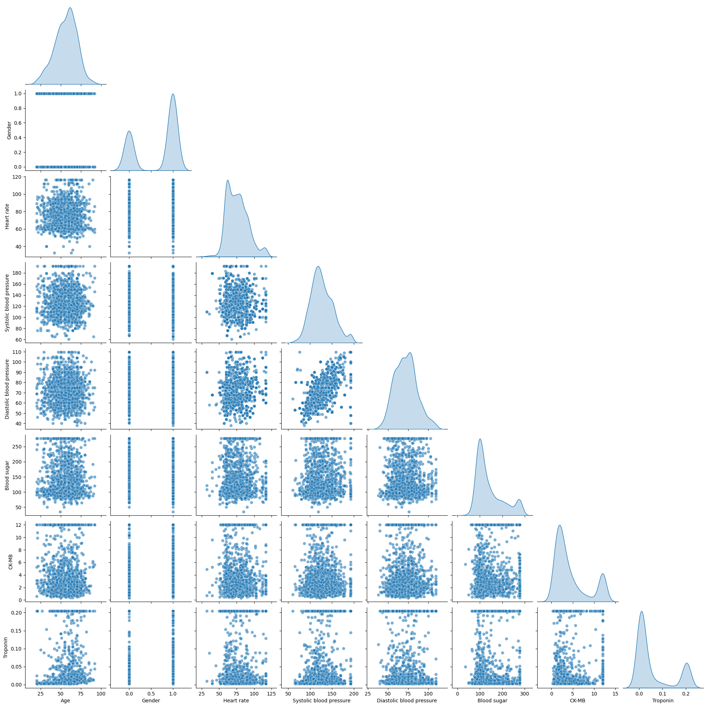

# Laporan Proyek Machine Learning - Muhammad Zukarnaini

## Domain Proyek

### **Latar Belakang**

### **Latar Belakang**

Penyakit jantung koroner (PJK), terutama serangan jantung, merupakan salah satu penyebab utama kematian di dunia. Menurut data [Organisasi Kesehatan Dunia (WHO)](https://www.who.int/news-room/fact-sheets/detail/cardiovascular-diseases-%28cvds%29), penyakit jantung menyebabkan lebih dari 17 juta kematian setiap tahun, angka yang terus meningkat dari waktu ke waktu. Serangan jantung terjadi ketika aliran darah yang kaya oksigen ke bagian tertentu dari jantung terganggu, yang mengakibatkan kerusakan permanen pada jaringan jantung. Hal ini disebabkan oleh penumpukan plak yang menghambat arteri koronaria atau penyempitan pembuluh darah. Oleh karena itu, deteksi dini serangan jantung menjadi sangat penting, terutama bagi individu yang berisiko tinggi, untuk melakukan intervensi medis yang cepat dan tepat.

Serangan jantung sering kali datang tanpa peringatan sebelumnya, dan dapat terjadi secara tiba-tiba. Beberapa faktor risiko utama yang dapat meningkatkan kemungkinan seseorang mengalami serangan jantung termasuk merokok, tekanan darah tinggi, kadar kolesterol tinggi, diabetes, obesitas, dan gaya hidup yang kurang aktif. Selain itu, usia dan jenis kelamin juga berperan sebagai faktor risiko yang signifikan. Sebagai contoh, pria lebih berisiko mengalami serangan jantung lebih awal daripada wanita. Mengingat kompleksitas dan variabilitas faktor-faktor risiko ini, mendiagnosis kemungkinan serangan jantung pada tahap awal menjadi sangat sulit, terutama dengan menggunakan metode pemeriksaan konvensional yang memerlukan waktu lama.

Di era modern ini, teknologi pembelajaran mesin (machine learning) menawarkan pendekatan yang lebih efisien dan cepat dalam mendiagnosis penyakit jantung, termasuk serangan jantung. Pembelajaran mesin menggunakan algoritma untuk mempelajari pola-pola dalam data dan membuat prediksi berdasarkan informasi yang tersedia. Dengan memanfaatkan data medis, seperti hasil pemeriksaan fisik, tes darah, dan rekam medis lainnya, pembelajaran mesin dapat menganalisis informasi secara lebih cepat dan akurat daripada metode tradisional.

Sejumlah penelitian telah menunjukkan potensi besar pembelajaran mesin dalam memprediksi serangan jantung. Misalnya, penelitian oleh [Kaur et al. (2016)](https://iopscience.iop.org/article/10.1088/1757-899X/1022/1/012046) menunjukkan bahwa algoritma pembelajaran mesin, seperti K-Nearest Neighbor (K-NN) dan Support Vector Machine (SVM), dapat digunakan untuk memprediksi kemungkinan seseorang mengalami serangan jantung dengan akurasi yang tinggi, mencapai lebih dari 86.88%. Penelitian lain, seperti yang dilakukan oleh [Ganaie et al. (2017)](https://www.researchgate.net/publication/383112353_Heart_Disease_Prediction_and_GUI_Interaction_based_on_Machine_Learning), menunjukkan bahwa penggunaan model berbasis pembelajaran mesin dapat membantu dokter dalam memproses data lebih efisien, mengidentifikasi pasien berisiko tinggi, dan memberikan perawatan yang lebih tepat.

Dalam beberapa tahun terakhir, dataset yang mengandung berbagai informasi medis mengenai individu, termasuk usia, jenis kelamin, tekanan darah, kadar kolesterol, dan hasil tes lainnya, telah menjadi bahan penting untuk pengembangan model prediksi. Dengan menggabungkan faktor-faktor tersebut dalam satu model, algoritma pembelajaran mesin dapat memberikan prediksi yang lebih presisi tentang kemungkinan terjadinya serangan jantung. Salah satu model yang sering digunakan untuk tujuan ini adalah Random Forest, yang terbukti efektif dalam menangani data yang memiliki banyak fitur dan hubungan yang kompleks.

Namun, meskipun algoritma seperti Random Forest dan SVM menunjukkan hasil yang menjanjikan, masalah ketidakseimbangan data sering kali muncul, di mana jumlah individu yang mengalami serangan jantung jauh lebih sedikit dibandingkan yang tidak mengalami serangan jantung. Oleh karena itu, penting untuk melakukan teknik ekstraksi dan balancing data untuk memastikan model dapat memberik

## Business Understanding

### Problem Statements

2. Bagaimana cara memprediksi kemungkinan seseorang mengalami serangan jantung berdasarkan faktor-faktor kesehatan yang dimilikinya, seperti usia, jenis kelamin, tekanan darah, kadar gula darah, dan biomarker lainnya?
3. Sejauh mana akurasi model pembelajaran mesin (seperti Random Forest, Decision Tree, dan Naive Bayes) dalam memprediksi serangan jantung dibandingkan dengan metode konvensional yang ada?

### Goals

1. Membangun model prediktif untuk memprediksi kemungkinan serangan jantung berdasarkan faktor kesehatan seperti usia, jenis kelamin, tekanan darah, kadar gula darah, dan biomarker lainnya.
2. Seberapa akurat model pembelajaran mesin (Random Forest, Decision Trees, Naive Bayes) dapat memprediksi serangan jantung.
3. Meningkatkan akurasi prediksi serangan jantung dengan menerapkan hyperparameter tuning pada algoritma pembelajaran mesin (Random Forest, Decision Trees, Naive Bayes).

### Solution Statement

1. Mengembangkan sebuah model machine learning untuk memprediksi kemungkinan seseorang terkena serangan jantung berdasarkan faktor-faktor kesehatan yang dialami.
2. Mengevaluasi kinerja model Machine Learning dengan berbagai metrik evaluasi seperti akurasi, precision, recall, F1-score, dan confusion matrix, guna memastikan model memiliki performa yang optimal dalam mendeteksi serangan jantung.

## Data Understanding

**`Heart Attack Prediction Dataset`** adalah kumpulan data medis yang berisi informasi tentang pasien yang dirawat di Rumah Sakit Zheen di Erbil, Irak, dari Januari 2019 hingga Mei 2019. Dataset ini mencakup 9 atribut medis dan 1319 baris yang dapat digunakan untuk memprediksi kemungkinan serangan jantung, dengan hasil berupa label positif (terkena serangan jantung) atau negatif (tidak terkena serangan jantung). Dataset ini sudah dibersihkan dan tidak mengandung nilai yang hilang. **[Kaggle](https://www.kaggle.com/datasets/fatemehmohammadinia/heart-attack-dataset-tarik-a-rashid)**.

### Variabel-variabel pada Diabetes prediction dataset adalah sebagai berikut:

- **`gender`** :Jenis kelamin yang merujuk pada perbedaan biologis antara laki-laki dan perempuan, yang dapat memengaruhi risiko seseorang terhadap diabetes. Terdapat tiga kategori pada variabel ini: laki-laki, perempuan, dan lainnya.
- **`age`** : Usia merupakan faktor yang sangat penting karena diabetes lebih sering didiagnosis pada individu yang lebih tua. Dalam dataset ini, rentang usia yang tercatat adalah antara 0 hingga 80 tahun.
- **`Heart Rate:`** : Denyut jantung per menit
- **`Systolic Blood Pressure`** : Tekanan darah sistolik (tekanan saat jantung berkontraksi)
- **`Diastolic Blood Pressure`** : Tekanan darah diastolik (tekanan di antara detak jantung).
- **`Blood Sugar`** : Kadar gula darah pasien (Gula darah > 120 = 1, sebaliknya = 0).
- **`Ck-mb`** : Enzim jantung yang dilepaskan saat terjadi kerusakan pada otot jantung.
- **`Troponin`** :Protein biomarker yang sangat spesifik untuk cedera otot jantung.
- **`Result`** : Hasil yang menunjukkan apakah pasien mengalami serangan jantung (positif = 1, negatif = 0)

### Visualisasi Distribusi Data Numerik

Visualisasi distribusi untuk variabel numerik menunjukkan beberapa pola yang menarik. **Age** memiliki distribusi yang cenderung normal, meskipun ada sedikit skew di ujung kanan, yang menunjukkan sebagian besar sampel berfokus pada usia yang lebih muda, namun terdapat sejumlah kecil individu yang lebih tua. **Gender** menunjukkan distribusi yang tidak seimbang, dengan lebih banyak individu berjenis kelamin laki-laki (kode 1) dibandingkan perempuan (kode 0). **Heart Rate** memiliki distribusi yang agak miring, dengan puncak di sekitar 60 hingga 80 denyut per menit, namun terdapat beberapa individu dengan detak jantung lebih tinggi dari rata-rata. **Systolic Blood Pressure** memperlihatkan puncak pada sekitar 120 mmHg, nilai normal tekanan darah, namun ada juga individu dengan tekanan darah yang lebih tinggi. **Diastolic Blood Pressure** memiliki distribusi yang lebih tersebar, dengan puncak di sekitar 70 mmHg, menunjukkan variasi yang lebih besar dalam tekanan darah diastolik. **Blood Sugar** menunjukkan distribusi multimodal, dengan beberapa puncak yang menunjukkan variasi dalam kadar gula darah, mencerminkan perbedaan dalam status metabolik individu. **CK-MB** memiliki distribusi dengan puncak di nilai rendah, namun ada juga banyak nilai ekstrim di sisi kanan, mengindikasikan beberapa individu dengan kadar CK-MB tinggi, biomarker penting untuk kerusakan otot jantung. **Troponin** menunjukkan distribusi yang sangat miring, dengan sebagian besar nilai berada di angka rendah, tetapi ada beberapa individu dengan kadar troponin tinggi, yang terkait dengan cedera otot jantung. Distribusi ini menunjukkan variasi yang signifikan pada data, yang memberikan wawasan penting untuk membangun model prediktif yang efektif dalam memprediksi risiko serangan jantung.


### **Visualisasi Distribusi Kelas Target**

Visualisasi ini menunjukkan distribusi dua kelas pada variabel **`Result`**. Dari grafik tersebut, terlihat bahwa jumlah individu yang memiliki label **`positive`** (terkena serangan jantung) lebih banyak dibandingkan dengan yang memiliki label **`negative`** (tidak terkena serangan jantung). Kelas **`positive`** menunjukkan frekuensi yang lebih tinggi, sementara kelas **`negative`** relatif lebih sedikit. Hal ini menunjukkan ketidakseimbangan dalam dataset, yang sering terjadi dalam kasus prediksi penyakit, di mana jumlah pasien yang mengalami kondisi yang ditargetkan (serangan jantung) biasanya lebih sedikit dibandingkan dengan yang tidak mengalami.


### **Visualisasi Kernel Density Estimation**

Visualisasi KDE (Kernel Density Estimation) menunjukkan hubungan antara berbagai fitur dalam dataset. **Scatter plot** di bagian bawah diagonal menggambarkan distribusi titik data untuk pasangan variabel yang relevan, memberikan gambaran visual mengenai korelasi antar fitur. Sementara itu, **plot KDE** yang terletak di diagonal menunjukkan distribusi probabilitas dari setiap variabel. Beberapa fitur seperti **Systolic Blood Pressure**, **Diastolic Blood Pressure**, dan **Heart Rate** menunjukkan distribusi yang lebih normal, mencerminkan pola yang lebih konsisten dalam data. Variabel seperti **Blood Sugar** dan **Troponin** menunjukkan distribusi yang lebih terpusat dengan puncak yang jelas, mengindikasikan variasi yang lebih terbatas dalam nilai-nilai tersebut. Sedangkan variabel biner seperti **Gender** menunjukkan distribusi yang terpisah, dengan sedikit pola dalam scatter plot, yang mengindikasikan bahwa faktor ini tidak memiliki korelasi yang kuat dengan variabel lain di dataset.



### **Visualisasi Correlation Matrix**

Matriks korelasi memberikan wawasan tentang hubungan antar fitur numerik dalam dataset. Dari matriks ini, dapat terlihat bahwa **Systolic Blood Pressure** dan **Diastolic Blood Pressure** memiliki korelasi yang cukup tinggi (0.60), yang menunjukkan hubungan yang kuat antara kedua jenis tekanan darah tersebut. **Age** memiliki korelasi positif yang moderat dengan **Troponin** (0.17) dan **Systolic Blood Pressure** (0.02). Sementara itu, **Blood Sugar** memiliki korelasi yang sangat rendah dengan variabel lainnya, yang mengindikasikan bahwa **Blood Sugar** tidak banyak berhubungan dengan faktor-faktor lain dalam dataset ini.
**Heart Rate** dan **Diastolic Blood Pressure** menunjukkan korelasi yang cukup rendah (0.13), namun keduanya tetap berperan dalam menentukan kondisi jantung seseorang. **CK-MB** memiliki korelasi rendah dengan semua variabel.


## Data Preparation

- **`Handling Outlier`** : Outlier pada fitur numerik diidentifikasi menggunakan metode Interquartile Range (IQR). Setelah outlier ditemukan, dilakukan teknik clipping untuk membatasi nilai-nilai yang berada di luar rentang batas yang telah ditentukan. Outlier bisa memberikan pengaruh yang tidak proporsional dalam pelatihan model, sehingga clipping diterapkan untuk mengurangi efek ekstrem dan memastikan bahwa model dilatih menggunakan data yang lebih relevan dan representatif, tanpa terdistorsi oleh nilai-nilai yang sangat jauh dari distribusi data utama.
  **Alasan Diterapkan** : Outlier bisa memiliki dampak besar pada model, mengarah pada overfitting dan mempengaruhi kualitas prediksi. Oleh karena itu, teknik clipping digunakan untuk mengatasi hal ini, memastikan bahwa model tidak terdistorsi oleh nilai-nilai ekstrem.

  ```python
    numeric = ['Age', 'Gender', 'Heart rate', 'Systolic blood pressure', 'Diastolic blood pressure', 'Blood sugar', 'CK-MB', 'Troponin']
    outlierValues = {}
    data_before_clipping = data[numeric].copy()

    # Deteksi dan Clipping Outlier
    for col in numeric:
        q1, q3 = np.percentile(data[col].dropna(), [25, 75])
        iqr = q3 - q1
        lower, upper = q1 - 1.5 * iqr, q3 + 1.5 * iqr

        outliers = data[col][(data[col] < lower) | (data[col] > upper)]
        outlierValues[col] = outliers

        data[col] = np.clip(data[col], lower, upper)
  ```

- **`Standarisasi`** : Untuk fitur numerik dilakukan standarisasi menggunakan StandardScaler. Proses ini memastikan bahwa nilai-nilai fitur berada dalam rentang yang lebih seragam. Standarisasi ini penting karena perbedaan skala antar fitur bisa mempengaruhi kinerja model, terutama pada algoritma pembelajaran mesin yang sensitif terhadap skala data. Dengan menstandarisasi data, kita membantu model agar lebih cepat dan stabil dalam proses optimasi, serta menghindari bias pada fitur yang memiliki rentang nilai jauh lebih besar.
  **Alasan Diterapkan**: Standarisasi penting untuk memastikan bahwa semua fitur berada dalam skala yang sama. Fitur yang memiliki rentang nilai yang sangat berbeda, yang dapat mempengaruhi kinerja model, terutama model yang sensitif terhadap skala data, seperti Decision Tree dan Random Forest.
  ```python
    numeric = ['Age','Heart rate', 'Systolic blood pressure', 'Diastolic blood pressure', 'Blood sugar', 'CK-MB', 'Troponin']
    scaler = StandardScaler()
    data[numeric] = scaler.fit_transform(data[numeric])
  ```
- **`Spliting Data`** : Dataset dibagi menjadi dua bagian, yaitu 80% untuk data pelatihan dan 20% untuk data pengujian. Target atau label yang diprediksi adalah kolom Result. Pemisahan data ini sangat penting untuk mengevaluasi kinerja model pada data yang tidak dilihat selama pelatihan. Dengan cara ini, kita dapat mengukur kemampuan model untuk menggeneralisasi dan menghindari overfitting. Pemisahan data juga memungkinkan kita untuk menguji model di lingkungan dunia nyata dengan data baru yang belum pernah dipelajari sebelumnya.
  ```python
    X = data.drop(columns=["Result"])
    y = data["Result"]
    X_train, X_test, y_train, y_test = train_test_split(X, y, test_size=0.2, random_state=42)
  ```

## Modeling

Pada Projek ini, model yang digunakan untuk memprediksi kemungkinan seseorang terkenal serangan berdasarkan fitur-fitur yang tersedia adalah Decision Tree, Random Forest, dan Naive Bayes. Pemilihan ketiga model ini didasarkan pada karakteristik dan keunggulannya masing-masing dalam menangani masalah prediksi terkenal serangan. Berikut adalah alasan pemilihan model-model tersebut:

- **Decision Tree**: Decision Tree adalah model yang mudah dipahami dan sangat efektif dalam klasifikasi. Keunggulannya adalah kemampuan untuk menangani data non-linear dengan baik dan memberikan interpretasi yang jelas mengenai proses pengambilan keputusan. Meskipun demikian, model ini cenderung rentan terhadap overfitting, terutama jika pohon keputusan terlalu dalam. Oleh karena itu, teknik pruning atau pembatasan kedalaman pohon sering digunakan untuk mengatasi masalah ini.
- **Random Forest**: Ini adalah metode ensemble yang menggabungkan banyak pohon keputusan (decision tree) untuk menghasilkan keputusan yang lebih robust. Kelebihan utama dari Random Forest adalah kemampuannya dalam menangani data non-linear dan kemampuannya untuk mengurangi risiko overfitting dibandingkan dengan model pohon keputusan tunggal. Meskipun demikian, Random Forest bisa lebih lambat dalam proses pelatihan dan prediksi ketika dibandingkan dengan model boosting.
- **Naive Bayes**: Model ini berbasis pada teorema Bayes dengan asumsi independensi antar fitur. Keunggulan utama dari Naive Bayes adalah kemampuannya dalam memproses data dalam jumlah besar dengan cepat dan efisien. Meskipun asumsi independensi fitur terkadang tidak valid, Naive Bayes sering memberikan hasil yang baik untuk masalah klasifikasi sederhana dan berguna dalam kondisi data yang tidak terlalu rumit.

Tahapan yang Dilakukan dalam Proses Pemodelan:

1. **`Load Model`**:

   - **Random Forest** dimuat dengan parameter `n_estimators=100` dan `random_state=42`:
     ```python
     random_forest = RandomForestClassifier(n_estimators=100, random_state=42)
     ```
   - **Decision Tree** dimuat dengan parameter `random_state=42`:
     ```python
     decision_tree = DecisionTreeClassifier(random_state=42)
     ```
   - **Naive Bayes** :
     ```python
     naive_bayes = BernoulliNB()
     ```

2. **`Pelatihan Model`**:

   - **Random Forest** dilatih menggunakan data pelatihanu `X_train dan y_train`:
     ```python
     random_forest.fit(X_train, y_train)
     ```
   - **Decision Tree** dilatih menggunakan data pelatihanu `X_train dan y_train`:
     ```python
     decision_tree.fit(X_train, y_train)
     ```
   - **Naive Bayes** dilatih menggunakan data pelatihanu `X_train dan y_train`:
     ```python
     naive_bayes.fit(X_train, y_train)
     ```

3. **Evaluasi Model**:
   Hasil pelatihan dari ketiga model dibandingkan untuk menentukan model terbaik berdasarkan metrik evaluasi.

Setelah melatih ketiga model, hasil prediksi dari masing-masing model dievaluasi menggunakan metrik yang relevan, seperti akurasi, precision, recall, dan F1-score. Hal ini dilakukan untuk membandingkan kinerja masing-masing model dan memilih model terbaik yang dapat memberikan prediksi yang lebih akurat.

Setelah evaluasi awal, Random Forest dipilih sebagai model terbaik berdasarkan kinerja prediksi yang paling optimal dibandingkan dengan Decision Tree dan Naive Bayes. Model ini memberikan hasil yang paling akurat dalam memprediksi pasien terkena serangan jantung.

## Evaluation

**Evaluasi model** dilakukan dengan menggunakan sejumlah metrik kunci yang relevan untuk masalah klasifikasi biner, di antaranya **Accuracy**, **Precision**, **Recall**, **F1-Score**, dan **Confusion Matrix**. Metrik-metrik ini dipilih karena dataset yang digunakan berkaitan dengan prediksi kondisi kesehatan (kemungkinan seseorang terkena serangan), di mana penting untuk mempertimbangkan keseimbangan antara deteksi kasus positif dan negatif. Evaluasi ini bertujuan untuk memastikan bahwa model tidak hanya memprediksi dengan tepat, tetapi juga mengurangi kesalahan dalam mendeteksi pasien yang berisiko tinggi.

Metrik Evaluasi yang Digunakan

1. **`Accuracy Score`** :

   - **Accuracy**: Mengukur persentase prediksi yang benar dari total data. Metrik ini memberikan gambaran umum tentang kinerja model, meskipun dalam beberapa kasus, seperti ketidakseimbangan kelas, akurasi saja bisa menyesatkan.

$$
\text{Accuracy} = \frac{TP + TN}{TP + TN + FP + FN}
$$

```python
print(f"Akurasi: {accuracy_score(y_test, y_pred_dt):.4f}")
```

2. **`Classification Report`** :

   - **Precision**: Menunjukkan seberapa banyak dari prediksi positif yang benar-benar positif. Dalam konteks ini, precision menggambarkan seberapa banyak pasien yang diprediksi terkena serangan jantung benar-benar mengidapnya. Precision yang tinggi mengurangi risiko memberikan diagnosis positif yang salah.

$$
\text{Precision} = \frac{TP}{TP + FP}
$$

- **Recall (Sensitivity)**: Mengukur seberapa banyak kasus positif yang benar-benar berhasil dideteksi oleh model. Recall sangat penting dalam situasi medis, di mana kegagalan untuk mendeteksi seseorang yang terkena serangan (false negative) bisa berakibat fatal.

$$
\text{Recall} = \frac{TP}{TP + FN}
$$

- **F1-Score**: Merupakan rata-rata harmonis antara precision dan recall. F1-score memberikan gambaran yang lebih seimbang antara keduanya, terutama jika data cenderung tidak seimbang, dan membantu menilai trade-off antara precision dan recall.

$$
\text{F1-Score} = 2 \times \frac{\text{Precision} \times \text{Recall}}{\text{Precision} + \text{Recall}}
$$

```python
print("\nClassification Report:\n", classification_report(y_test, y_pred))
```

3. **`Confusion Matrix`** : Matriks ini memberikan rincian dari prediksi model, mengklasifikasikan jumlah true positives, true negatives, false positives, dan false negatives. Hal ini sangat berguna untuk menganalisis jenis kesalahan yang dilakukan oleh model, misalnya, apakah lebih sering gagal mendeteksi serangan jantung atau mengidentifikasi orang sehat sebagai penderita serangan jantung.

   |                    | Predicted Negatif (0) | Predicted Positif (1) |
   | ------------------ | --------------------- | --------------------- |
   | Actual Negatif (0) | True Negative (TN)    | False Positive (FP)   |
   | Actual Positif (1) | False Negative (FN)   | True Positive (TP)    |

   ```python
   cm_dt = confusion_matrix(y_test, y_pred_dt)
   ```

Berikut adalah ringkasan hasil evaluasi berdasarkan prediksi pada data :

1. Accuracy dan Classification Report :

   | Model         | Accuracy | Precision | Recall | F1-Score |
   | ------------- | -------- | --------- | ------ | -------- |
   | Random Forest | 0.9811   | 0.98      | 0.99   | 0.98     |
   | Decision Tree | 0.9773   | 0.98      | 0.98   | 0.98     |
   | Naive Bayes   | 0.8030   | 0.86      | 0.81   | 0.84     |

### **Analisis Hasil:**

- **Accuracy**: Ketiga model menunjukkan akurasi yang sangat tinggi. **Random Forest** memiliki akurasi tertinggi (0.9811), diikuti oleh **Decision Tree** (0.9773), dan **Naive Bayes** (0.8030). Meskipun **Random Forest** memiliki akurasi sedikit lebih tinggi, **Decision Tree** masih menunjukkan akurasi yang sangat baik dengan sedikit perbedaan.

- **Precision**: Semua model menunjukkan **precision** tinggi, dengan **Random Forest** dan **Decision Tree** memiliki nilai precision yang sangat mendekati (0.98), sementara **Naive Bayes** memiliki precision lebih rendah (0.86). Ini berarti bahwa model-model ini jarang memberikan prediksi positif yang salah (False Positive), menunjukkan bahwa model dapat diandalkan dalam memprediksi individu yang berisiko mengalami serangan jantung.

- **Recall**: **Random Forest** dan **Decision Tree** menunjukkan nilai **recall** yang lebih tinggi (0.99 dan 0.98) dibandingkan dengan **Naive Bayes** (0.81). Ini menunjukkan bahwa kedua model ini mampu mendeteksi sebagian besar kasus positif (serangan jantung), yang sangat penting dalam konteks medis karena dapat mencegah kegagalan dalam mendeteksi pasien berisiko.

- **F1-Score**: Nilai **F1-Score** memberikan keseimbangan antara **precision** dan **recall**. **Random Forest** dan **Decision Tree** memiliki nilai F1-Score yang sangat mirip (sekitar 0.98), yang menunjukkan bahwa kedua model ini memiliki keseimbangan yang sangat baik antara precision dan recall. Sementara itu, **Naive Bayes** memiliki F1-Score lebih rendah (0.84), yang menunjukkan bahwa meskipun model ini cukup baik dalam hal precision, recall-nya sedikit lebih rendah.

Berdasarkan hasil evaluasi, meskipun Decision Tree menunjukkan keseimbangan yang baik antara precision dan recall, Random Forest dipilih sebagai model terbaik. Random Forest menunjukkan akurasi tertinggi (0.9811) dan memiliki precision serta recall yang sangat tinggi (0.98 dan 0.99), yang menunjukkan bahwa model ini dapat mendeteksi dengan sangat akurat baik kasus positif maupun negatif. Meskipun Decision Tree juga memberikan hasil yang baik, dengan F1-Score dan recall yang sedikit lebih baik, Random Forest memberikan performa keseluruhan yang lebih baik dalam memprediksi serangan jantung, yang sangat penting dalam aplikasi medis untuk deteksi dini dan pengambilan keputusan yang cepat. Dengan akurasi yang sangat tinggi dan kemampuan untuk menangani data yang lebih kompleks, Random Forest menjadi pilihan yang lebih unggul untuk prediksi serangan jantung.

2. Analisis Berdasarkan Confusion Matrix:

   | Model         | Actual             | Predicted Negatif (0) | Predicted Positif (1) |
   | ------------- | ------------------ | --------------------- | --------------------- |
   | Random Forest | Actual Negatif (0) | 98                    | 3                     |
   | Random Forest | Actual Positif (1) | 2                     | 161                   |
   | Decision Tree | Actual Negatif (0) | 80                    | 21                    |
   | Decision Tree | Actual Positif (1) | 31                    | 132                   |
   | Naive Bayes   | Actual Negatif (0) | 98                    | 3                     |
   | Naive Bayes   | Actual Positif (1) | 3                     | 160                   |

   Berdasarkan hasil dari confusion matrix untuk ketiga model, berikut adalah poin-poin penting yang perlu diperhatikan:

   1. Performa dalam Mengklasifikasikan Kelas Negatif (0):

      Ketiga model menunjukkan performa yang sangat baik dalam mengklasifikasikan kelas negatif (0), yang tercermin dalam jumlah **True Negative (TN)** yang sangat tinggi dan **False Positive (FP)** yang sangat rendah. Ini menunjukkan bahwa model-model tersebut jarang salah mengklasifikasikan individu yang tidak mengalami serangan jantung sebagai positif. Sebagai contoh, **Random Forest** mengklasifikasikan 98 kasus negatif dengan benar, sementara hanya 3 yang salah diklasifikasikan sebagai positif. Begitu juga dengan **Naive Bayes** dan **Decision Tree**, yang keduanya menunjukkan kemampuan baik dalam mengklasifikasikan kasus negatif.

   2. Performa dalam Mengklasifikasikan Kelas Positif (1):
      Meskipun ketiga model sangat baik dalam mendeteksi kelas negatif, ada perbedaan signifikan dalam cara mereka menangani kelas positif (1):

   - **Naive Bayes** menunjukkan jumlah **False Negative (FN)** tertinggi, dengan 3 kasus positif yang tidak terdeteksi dengan baik (dikelompokkan sebagai negatif). Ini berarti model **Naive Bayes** lebih sering gagal mendeteksi individu yang benar-benar mengidap penyakit jantung.
   - **Decision Tree** memiliki **False Negative** yang lebih rendah (31) dibandingkan dengan **Naive Bayes** dan **False Positive** yang lebih rendah dibandingkan dengan **Random Forest** (21). Dengan demikian, **Decision Tree** lebih baik dalam mendeteksi kasus positif tanpa terlalu banyak menghasilkan kesalahan klasifikasi.

   3. Keunggulan Decision Tree:

      ### **3. Keunggulan Random Forest**

      **Random Forest** menunjukkan keunggulan yang signifikan dalam hal **akurasi keseluruhan**, dengan nilai **accuracy** tertinggi di antara ketiga model. Keunggulan utama dari **Random Forest** adalah kemampuannya untuk menangani data dengan banyak fitur dan hubungan yang kompleks dengan cara yang lebih efektif dibandingkan dengan model lain. Beberapa keunggulan **Random Forest** yang perlu diperhatikan:

      1. **Akurasi Tinggi**:
         **Random Forest** memiliki **akurasi** yang paling tinggi di antara ketiga model, mencapai 98.11%. Ini menunjukkan bahwa model ini sangat andal dalam memprediksi kedua kelas, baik **negatif** (tidak terkena serangan jantung) maupun **positif** (terkena serangan jantung).

      2. **Kekuatan dalam Mengatasi Overfitting**:
         **Random Forest** memiliki kemampuan untuk mengatasi masalah **overfitting** yang sering terjadi pada model yang lebih sederhana, seperti **Decision Tree**. Dengan menggunakan teknik ensemble learning (kombinasi banyak pohon keputusan), model ini menghasilkan prediksi yang lebih stabil dan generalisasi yang lebih baik terhadap data yang belum terlihat.

      3. **Performa yang Stabil**:
         Meskipun beberapa model lainnya mungkin mengalami fluktuasi dalam performa saat menghadapi data yang lebih rumit atau tidak seimbang, **Random Forest** menunjukkan kestabilan yang sangat baik di seluruh data, dengan nilai **precision**, **recall**, dan **F1-Score** yang sangat tinggi. Ini menunjukkan bahwa model ini dapat diandalkan untuk prediksi di berbagai jenis data.

      4. **Kemampuan Menangani Data Besar dan Kompleks**:
         **Random Forest** memiliki kemampuan untuk menangani dataset besar dengan banyak fitur dan dapat memodelkan hubungan yang lebih kompleks di dalam data. Ini membuatnya sangat efektif ketika jumlah variabel atau fitur dalam dataset cukup besar, seperti dalam kasus prediksi serangan jantung yang melibatkan berbagai biomarker dan data medis.

      5. **Mengurangi Risiko Kesalahan Klasifikasi**:
         Dengan menggunakan banyak pohon keputusan yang independen, **Random Forest** cenderung mengurangi kesalahan klasifikasi yang mungkin terjadi pada model berbasis pohon keputusan tunggal. Hasilnya, model ini lebih akurat dalam klasifikasi, termasuk dalam mengidentifikasi kasus **positif** yang tidak terdeteksi dengan baik oleh model lain.

Secara keseluruhan, **Random Forest** menawarkan keseimbangan antara **akurasi tinggi** dan **kekuatan dalam mengatasi masalah overfitting**, menjadikannya pilihan terbaik untuk aplikasi medis, seperti prediksi serangan jantung, yang membutuhkan prediksi yang sangat akurat dan stabil.
